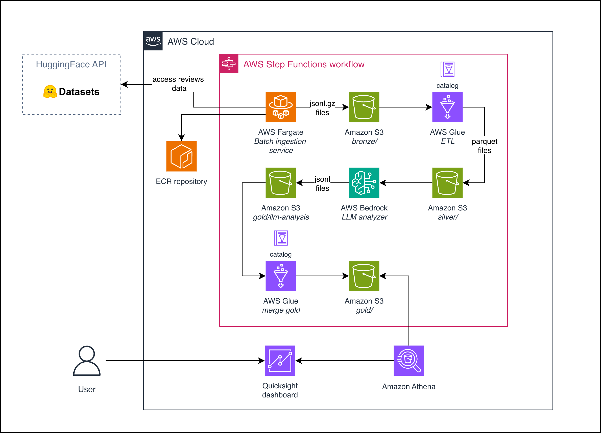
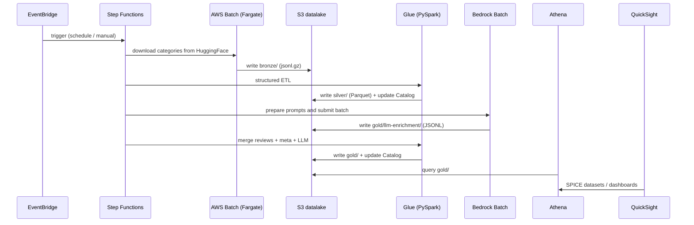

# Amazon Reviews Analyzer

Serverless analytics platform built on AWS over the [Amazon Reviews'23](https://amazon-reviews-2023.github.io/) dataset (McAuley Lab). The project ingests review and product metadata files from HuggingFace, stores raw data in a medallion data lake, enriches them with an LLM (classification/extraction), and publishes metrics and trends to a dashboard.

> **Status:** This repository contains the **architecture definition** and **scaffold** of the project. The S3 data lake (two buckets) and the Batch Fargate compute environment are deployable today. ETL, LLM enrichment, orchestration, and visualization layers are skeleton modules — see [Pending work](docs/dev.md#pending-work) in `docs/dev.md`.

---

## Table of contents

- [Overview](#overview)
- [Architecture diagram](#architecture-diagram)
- [AWS services](#aws-services)
- [Design decisions](#design-decisions)
- [End-to-end flow](#end-to-end-flow)
- [Repository structure](#repository-structure)
- [Costs](#costs)
- [Scaling roadmap](#scaling-roadmap)
- [Technical documentation](#technical-documentation)

---

## Overview

The pattern is a **serverless ELT with a medallion data lake** (bronze / silver / gold) on Amazon S3:

1. **Ingestion**: `.jsonl.gz` review and metadata files are downloaded from HuggingFace (`McAuley-Lab/Amazon-Reviews-2023`) and placed in the `bronze/` prefix of the data lake.
2. **Structuring**: AWS Glue (PySpark) cleans, types, deduplicates, and converts data to partitioned Parquet in `silver/`, registering tables in the Glue Data Catalog.
3. **LLM enrichment**: Amazon Bedrock (Batch Inference) classifies and extracts information from reviews (sentiment, aspects, topics, summary) asynchronously and cost-efficiently.
4. **Analytics**: structured data + enrichment are combined in `gold/`, queried with Amazon Athena, and visualized in Amazon QuickSight.

All orchestration runs on AWS Step Functions triggered by Amazon EventBridge.

**MVP scope:** a few small categories (e.g. `All_Beauty`, `Gift_Cards`, `Magazine_Subscriptions`, `Health_and_Personal_Care`) to validate the end-to-end pipeline at minimal cost, while keeping the architecture ready to scale to all 33 categories.

---

## Architecture diagram




---

## AWS services

| Layer | Service | Role | Status |
| --- | --- | --- | --- |
| Ingestion | **Amazon EventBridge Scheduler** | Triggers the pipeline (scheduled or on-demand). | Pending |
| Ingestion | **AWS Step Functions** | Orchestrates the flow: ingestion → silver → LLM → gold. | Pending |
| Ingestion | **AWS Batch on Fargate** | Runs the container that downloads `.jsonl.gz` files from HuggingFace to `bronze/`. | **Implemented** (compute env + job queue) |
| Ingestion | **Amazon ECR** | Docker image registry for the ingestion job. | Pending |
| Storage | **Amazon S3** | Medallion data lake in **2 buckets per environment**: `<prefix>-datalake` (prefixes `bronze/`, `silver/`, `gold/`, `scripts/`) and `<prefix>-athena-results`. | **Implemented** |
| Processing | **AWS Glue (PySpark)** | Structured ETL: jsonl → Parquet, normalization, dedup, partitioning, and gold merge. | Pending |
| Catalog | **AWS Glue Data Catalog** | Table/partition metastore for Athena and QuickSight. | Pending |
| LLM | **Amazon Bedrock (Batch Inference)** | Async classification/extraction (sentiment, aspects, topics, summary) with a low-cost model (Nova Lite / Claude Haiku). | Pending |
| Query | **Amazon Athena** | Serverless SQL over the data lake (dedicated workgroup + results bucket). | Pending |
| Visualization | **Amazon QuickSight** | SPICE dashboards of metrics and trends over Athena. | Pending |
| Cross-cutting | **IAM / KMS / CloudWatch** | Least-privilege roles per service, encryption at rest, logs/alarms/observability. | Pending |

---

## Design decisions

### Two S3 buckets instead of one per zone

The medallion zones (`bronze/`, `silver/`, `gold/`, `scripts/`) are **prefixes within a single bucket** (`<prefix>-datalake`). A second dedicated bucket for Athena (`<prefix>-athena-results`) is needed because its lifecycle and access policies differ from the data lake.

Using separate buckets per zone only adds value when hard limits (different IAM policies, KMS keys, or replication) are required between zones; for this project that would be unnecessary operational complexity.

### Glue Crawler: optional, not central

A **Glue Crawler does not extract data**: it scans S3 to *infer the schema* and create/update tables in the Data Catalog. The actual extraction/transformation is done by **Glue Jobs (PySpark)**.

- **Explicit table definitions** are preferred (writing partitions directly from the job): cheaper, faster, and deterministic, because the Amazon Reviews'23 schema is **known and stable**.
- Crawlers cost **DPU-hour per run**, add latency, and can **infer incorrect types** in nested fields (e.g. lists of `images`).
- Reserved for **initial discovery** or **schema drift** scenarios.

### Bedrock AgentCore: roadmapped, not in enrichment

**Bedrock AgentCore** is for building **autonomous agents** (multi-step reasoning, tools, memory, runtime). Review enrichment is a **massive, deterministic transformation** (prompt → response per batch), so:

- **Bedrock Batch Inference** is much **cheaper and simpler**, with no tool-calling or multi-step reasoning per review.
- An agent per review would be **expensive, slow, and overengineered**.

AgentCore is reserved for a **future conversational analytics layer** (natural language questions → Athena queries).

### Why Fargate and not Lambda for ingestion

Category files can be large (hundreds of MB to GB compressed). AWS Lambda has a **15-minute execution limit** and limited ephemeral storage; AWS Batch on Fargate handles long downloads and large files better.

---

## End-to-end flow



**Example dashboard metrics and trends:** average rating over time, sentiment distribution, top complaints/topics per category, `verified_purchase` vs. unverified comparison, helpfulness (`helpful_vote`), price vs. rating evolution.

---

## Repository structure

```
amazon-reviews-analyzer/
├── README.md
├── Makefile                       # lint, fmt, audit, tf-*, build
├── pyproject.toml                 # deps + ruff configuration
├── .python-version
├── docs/
│   ├── dev.md                     # deployment, IAM, and CI/CD guide
│   └── amazon-reviews-architecture.png
├── config/
│   ├── config.example.yaml        # configuration template
│   ├── dev.yaml
│   └── prod.yaml
├── terraform/
│   ├── providers.tf               # terraform{} + backend s3 + provider aws
│   ├── variables.tf
│   ├── main.tf
│   ├── terraform.tfvars           # dev values (region, project, subnet/SG IDs)
│   └── modules/
│       ├── s3_bucket/             # S3 bucket with lifecycle, versioning, KMS (optional)
│       ├── batch/                 # Fargate compute environment + job queue
│       ├── iam/                   # least-privilege roles (skeleton)
│       ├── glue/                  # catalog + PySpark jobs (skeleton)
│       ├── bedrock/               # batch inference (skeleton)
│       ├── step_functions/        # state machine + EventBridge (skeleton)
│       ├── athena/                # workgroup (skeleton)
│       ├── quicksight/            # dashboard (skeleton)
│       └── observability/         # CloudWatch (skeleton)
├── amazon_reviews_analyzer/
│   ├── utils/                     # YAML config loader, logging
│   ├── ingestion/                 # HF download -> S3 bronze/ (+ Dockerfile)
│   ├── etl/                       # Glue PySpark jobs (silver, gold-merge) — stubs
│   └── llm/                       # prompt builder + Bedrock batch client — stubs
└── .github/
    └── workflows/
        ├── terraform.yml
        └── services.yml
```

---

## Costs

All components are **pay-per-use**, so the small-category MVP keeps costs low. Optimization levers:

- **Bedrock Batch Inference** is cheaper than on-demand inference.
- **Parquet + partitioning** reduces the volume scanned by Athena (which charges per TB scanned).
- **SPICE** in QuickSight reduces repeated queries to Athena.
- **Lifecycle** applied to the `bronze/` prefix in the datalake bucket (transition to cold storage classes at 30 days / expiration at 180 days) reduces storage costs.
- Serverless components scale to zero when not in use (Fargate only runs during ingestion).

---

## Scaling roadmap

- Scale ingestion to more categories (including large ones like `Books`, `Electronics`, `Home_and_Kitchen`).
- Incremental/CDC ingestion for new reviews.
- Hybrid LLM pattern (initial batch + on-demand for new reviews).
- **Conversational analytics with Bedrock AgentCore**: an agent that translates natural language questions into Athena queries over the gold zone.
- Data quality (Glue Data Quality / Great Expectations) and governance (Lake Formation).
- **Redshift Serverless + Spectrum** as an alternative to Athena for silver/gold when high concurrency, complex large-scale joins, or consistent sub-second latency is required.

---

## Technical documentation

- [docs/dev.md](docs/dev.md): step-by-step deployment (Terraform), minimum IAM permissions per service, CI/CD pipeline description, and pending work.
