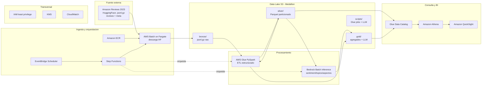
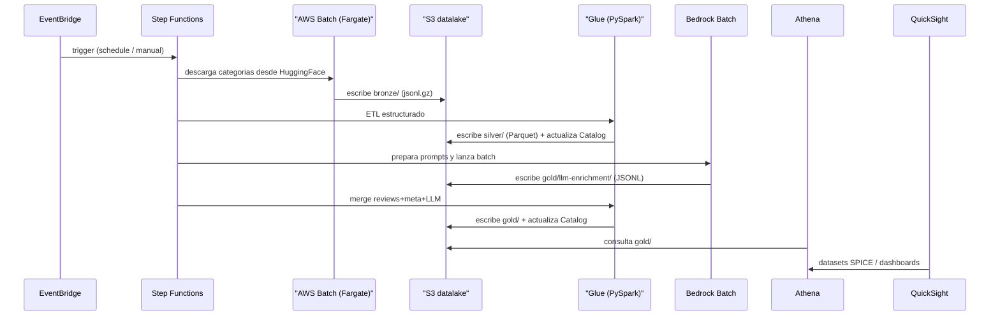

# Amazon Reviews Analyzer

Plataforma de analítica sobre el dataset [Amazon Reviews'23](https://amazon-reviews-2023.github.io/) (McAuley Lab) construida en AWS. El proyecto ingesta archivos de reviews y metadata de productos, extrae y almacena los datos estructurados en un data lake, los enriquece con un LLM (clasificación/extracción) y publica métricas y tendencias en un dashboard.

> Estado actual: este repositorio contiene la **definición de arquitectura** y el **scaffold** del proyecto (esqueletos de IaC, código y CI/CD). Aún no hay recursos AWS desplegados.

---

## Tabla de contenidos

- [Visión general](#visión-general)
- [Diagrama de arquitectura](#diagrama-de-arquitectura)
- [Servicios AWS](#servicios-aws)
- [Decisiones de diseño (por qué sí / por qué no)](#decisiones-de-diseño-por-qué-sí--por-qué-no)
- [Flujo end-to-end](#flujo-end-to-end)
- [Estructura del repositorio](#estructura-del-repositorio)
- [Costos](#costos)
- [Roadmap de escalado](#roadmap-de-escalado)
- [Documentación técnica](#documentación-técnica)

---

## Visión general

El patrón es un **ELT serverless con data lake medallion** (bronze / silver / gold) sobre Amazon S3:

1. **Ingesta**: se descargan los archivos `.jsonl.gz` de reviews y metadata desde HuggingFace (`McAuley-Lab/Amazon-Reviews-2023`) y se depositan en el prefijo `bronze/` del data lake.
2. **Estructuración**: AWS Glue (PySpark) limpia, tipa, deduplica y convierte a Parquet particionado en `silver/`, registrando las tablas en el Glue Data Catalog.
3. **Enriquecimiento LLM**: Amazon Bedrock (Batch Inference) clasifica y extrae información de los reviews (sentimiento, aspectos, tópicos, resumen) de forma asíncrona y económica.
4. **Analítica**: los datos estructurados + el enriquecimiento se combinan en `gold/`, se consultan con Amazon Athena y se visualizan en Amazon QuickSight.

Toda la orquestación corre con AWS Step Functions disparado por Amazon EventBridge.

**Alcance MVP:** pocas categorías pequeñas (p. ej. `All_Beauty`, `Gift_Cards`, `Magazine_Subscriptions`, `Health_and_Personal_Care`) para validar el pipeline end-to-end con costo mínimo, manteniendo la arquitectura preparada para escalar a las 33 categorías.

---

## Diagrama de arquitectura



---

## Servicios AWS

| Capa | Servicio | Rol en el proyecto |
| --- | --- | --- |
| Ingesta | **Amazon EventBridge Scheduler** | Dispara el pipeline (programado o on-demand). |
| Ingesta | **AWS Step Functions** | Orquesta el flujo: ingesta → silver → LLM → gold. |
| Ingesta | **AWS Batch on Fargate** | Ejecuta el contenedor que descarga los `.jsonl.gz` desde HuggingFace hacia `bronze/`. |
| Ingesta | **Amazon ECR** | Registro de la imagen Docker del job de ingesta. |
| Almacenamiento | **Amazon S3** | Data lake medallion en **2 buckets por ambiente**: `<prefix>-datalake` (prefijos `bronze/`, `silver/`, `gold/`, `scripts/`) y `<prefix>-athena-results`. |
| Procesamiento | **AWS Glue (PySpark)** | ETL estructurado: parseo jsonl → Parquet, normalización, dedup, particionado y merge a gold. |
| Catálogo | **AWS Glue Data Catalog** | Metastore de tablas/particiones para Athena y QuickSight. |
| LLM | **Amazon Bedrock (Batch Inference)** | Clasificación/extracción asíncrona (sentimiento, aspectos, tópicos, resumen) con modelo de bajo costo (Nova Lite / Claude Haiku). |
| Consulta | **Amazon Athena** | SQL serverless sobre el data lake (workgroup dedicado + bucket de resultados). |
| Visualización | **Amazon QuickSight** | Dashboards (SPICE) de métricas y tendencias sobre Athena. |
| Transversal | **IAM / KMS / CloudWatch** | Permisos mínimos por rol, cifrado en reposo, logs/alarmas/observabilidad. |

---

## Decisiones de diseño (por qué sí / por qué no)

### Dos buckets S3 en lugar de uno por zona

Las zonas medallion (`bronze/`, `silver/`, `gold/`, `scripts/`) son **prefijos dentro de un mismo bucket** (`<prefix>-datalake`). Un bucket adicional separado solo para Athena (`<prefix>-athena-results`) porque su lifecycle de expiración y sus políticas de acceso son distintos a los del data lake.

Usar múltiples buckets por zona solo aporta valor cuando se requieren límites duros distintos (políticas IAM, KMS keys o replicación) entre zonas; para este proyecto es innecesario y añade complejidad operativa.

### Glue Crawler: opcional, no protagonista

Un **Glue Crawler no extrae datos**: escanea S3 para *inferir el esquema* y crear/actualizar tablas en el Data Catalog. La extracción/transformación real la hacen los **Glue Jobs (PySpark)**.

- Se prefiere **definir las tablas explícitamente** o escribir particiones directamente desde el job: más barato, más rápido y determinista, porque el esquema de Amazon Reviews'23 es **conocido y estable**.
- Los crawlers cuestan **DPU-hora por ejecución**, agregan latencia y pueden **inferir tipos incorrectos** en campos anidados (p. ej. listas de `images`).
- Se reservan para **descubrimiento inicial** o **evolución de esquema** (schema drift).

### Bedrock AgentCore: fuera del enriquecimiento, en el roadmap

**Bedrock AgentCore** sirve para construir **agentes autónomos** (razonamiento multi-paso, herramientas/tools, memoria, runtime). El enriquecimiento de reviews es una **transformación masiva y determinista** (prompt → respuesta por lote), por lo que:

- **Bedrock Batch Inference** es mucho **más barato y simple**, sin tool-calling ni razonamiento multi-paso por review.
- Un agente por cada review sería **caro, lento y sobredimensionado**.

AgentCore se reserva para una **capa futura de analítica conversacional** (preguntas en lenguaje natural → consultas a Athena).

### Por qué Fargate y no Lambda para la ingesta

Los archivos por categoría pueden ser grandes (cientos de MB a GB comprimidos). AWS Lambda tiene límites de **15 min de ejecución** y almacenamiento efímero acotado; AWS Batch on Fargate maneja mejor descargas largas y archivos grandes.

---

## Flujo end-to-end



**Métricas y tendencias en el dashboard (ejemplos):** rating promedio en el tiempo, distribución de sentimiento, top quejas/tópicos por categoría, comparación `verified_purchase` vs. no verificado, utilidad (`helpful_vote`), evolución de precio vs. rating.

---

## Estructura del repositorio

```
amazon-reviews-analyzer/
├── README.md
├── Makefile                       # lint, fmt, audit, tf-*, build, deploy
├── pyproject.toml                 # deps + configuración de ruff
├── .python-version
├── docs/
│   └── dev.md                     # despliegue, IAM mínimo y CI/CD
├── config/
│   ├── config.example.yaml        # plantilla de variables de entorno
│   ├── dev.yaml                   # valores dev (gitignored si trae secretos)
│   └── prod.yaml                  # valores prod (gitignored si trae secretos)
├── terraform/
│   ├── providers.tf               # terraform{} + backend s3 + provider aws
│   ├── variables.tf
│   ├── main.tf
│   ├── environments/
│   │   ├── dev.tfvars
│   │   └── prod.tfvars
│   └── modules/
│       ├── s3_lake/               # 2 buckets: datalake + athena-results
│       ├── iam/  batch/  glue/  bedrock/
│       └── step_functions/  athena/  quicksight/  observability/
├── amazon_reviews_analyzer/
│   ├── utils/                     # loader de config YAML, logging
│   ├── ingestion/                 # descarga HF -> S3 bronze/ (incluye Dockerfile)
│   ├── etl/                       # scripts Glue PySpark (silver, gold)
│   └── llm/                       # prep de prompts + manejo Bedrock batch
└── .github/
    └── workflows/
        ├── terraform.yml
        └── python-services.yml
```

---

## Costos

Todos los componentes son **pay-per-use**, por lo que el MVP de categorías pequeñas mantiene el costo bajo. Palancas de optimización:

- **Bedrock Batch Inference** es más económico que la inferencia on-demand.
- **Parquet + particionado** reduce el volumen escaneado por Athena (que cobra por TB escaneado).
- **SPICE** en QuickSight reduce consultas repetidas a Athena.
- **Lifecycle** aplicado al prefijo `bronze/` dentro del bucket datalake (transición a clases frías a los 30 días / expiración a los 180 días) reduce el costo de almacenamiento.
- Componentes serverless escalan a cero cuando no se usan (Fargate solo corre durante la ingesta).

---

## Roadmap de escalado

- Escalar la ingesta a más categorías (incluidas grandes como `Books`, `Electronics`, `Home_and_Kitchen`).
- Ingesta incremental/CDC para nuevos reviews.
- Patrón híbrido de LLM (batch inicial + on-demand para reviews nuevos).
- **Analítica conversacional con Bedrock AgentCore**: un agente que traduce preguntas en lenguaje natural a consultas Athena sobre la zona gold.
- Calidad de datos (Glue Data Quality / Great Expectations) y gobernanza (Lake Formation).
- **Redshift Serverless + Spectrum** como alternativa a Athena para silver/gold cuando se requiera alta concurrencia, joins complejos a gran escala o latencia sub-segundo constante.

---

## Documentación técnica

- [docs/dev.md](docs/dev.md): despliegue paso a paso (Terraform), permisos IAM mínimos por servicio y descripción del pipeline CI/CD.
